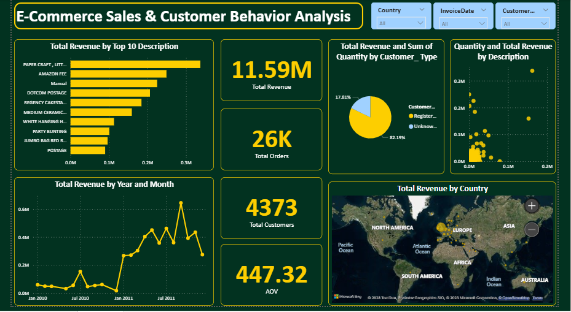

# Retail Sales & Customer Behavior Analysis

This project analyzes e-commerce transactional data to uncover insights around sales performance, customer behavior, product contribution, and geographic trends.

## 📌 Project Overview

This project analyzes e-commerce worldwide transactional data to uncover insights around sales performance, customer behavior, product contribution, and geographic trends. The goal is to transform raw sales data into actionable business insights using a modern analytics workflow. 
The analysis follows a real-world analytics pipeline, starting from Excel-based exploration and cleaning, through SQL and Python analysis, and ending with an interactive Power BI dashboard for stakeholder communication. 

## 🎯 Business Objectives
- Understand overall revenue performance
- Identify sales trends and seasonality
- Determine top revenue-generating products
- Analyze customer purchasing behavior
- Evaluate geographic market performance
- Support data-driven decisions on pricing, inventory, and customer retention

## 🧰 Tools & Technologies
- **Excel** – Data inspection, cleaning, calculated fields, pivot analysis
- **SQL** – Data storage, aggregation, and business queries
- **Python** – Exploratory data analysis and validation
- **Power BI** – Interactive dashboards and business storytelling

## 📂 Dataset Description

Dataset: Online Retail Dataset 

Data Type: Transaction-level e-commerce sales data 

Key Columns 

- InvoiceNo
- StockCode
- Description
- Quantity
- InvoiceDate
- UnitPrice
- CustomerID
- Country

The dataset represents what was sold, when it was sold, to whom, in what quantity, at what price, and from which country.

## 🧹 Data Cleaning & Preparation (Excel)

Excel was used as the first analysis tool, reflecting real-world business workflows.

Key Cleaning Steps

- Removed blank rows and duplicate records
- Handled missing CustomerID values by creating a Customer Type column instead of deleting valid transactions
- Identified zero-price transactions (e.g., free samples, promotions, test records)
- Flagged zero-price records using a Price Status column rather than manipulating values

Calculated Fields Created

- Total Sales (Revenue) = Quantity × UnitPrice
- Invoice Month – Enables trend analysis
- Year – Supports yearly comparison

This approach ensured data integrity while preserving valuable transactional records.

## 📊 Exploratory Data Analysis (Excel)

Pivot tables were used to quickly explore patterns and validate assumptions.

Key Insights

- Total Revenue: 11,585,621.15
- Monthly Sales Trend: Clear peaks indicating seasonality and promotional periods
- Top-Selling Product: Paper Craft, Little Birdie
- Quantity vs Revenue: High sales volume does not always equal high revenue
- Geographic Performance: United Kingdom dominates total sales revenue

## 🐍 Python Analysis

Python was used to perform deeper EDA and validation of insights discovered in Excel.

Key Tasks

- Verified data types and missing values
- Filtered normal transactions to ensure revenue accuracy
- Confirmed total revenue figures
- Analyzed:
  - Monthly sales trends
  - Product performance
  - Purchase frequency patterns

Python ensured analytical accuracy and scalability beyond spreadsheet limitations.

_You can access the Python File_ [here](https://github.com/ErickHdez616/Retail-sales-customer-behavior-analysis/blob/main/E-Commerce%20Sales%20and%20Customer%20Behavior%20Analysis%20.ipynb)

## 🗄️ SQL Analysis

SQL was used to efficiently answer business questions on cleaned transactional data.

Database Design

- Database name: ecommerce
- Cleaned data loaded from Python into SQL tables

Key Analyses

- Total revenue (excluding zero-price transactions)
- Monthly sales trends
- Top 10 products by revenue
- Revenue by country
- Top customers by revenue

SQL enabled fast aggregation and reproducible analysis on large datasets.

_You can access the Queries File_ [here](https://github.com/ErickHdez616/Retail-sales-customer-behavior-analysis/blob/main/Ecommerce.sql)

## 📈 Power BI Dashboard

Power BI was used to convert analysis into interactive business insights.

Key DAX Measures

- Total Revenue
- Total Orders
- Total Customers
- Average Order Value

Dashboard Highlights

- Total Revenue: 11.59M
- Total Orders: 26,000
- Total Customers: 4,373
- Average Order Value: 447.32

Insights

- Revenue is concentrated among a small set of top-performing products
- Registered customers generate the majority of revenue
- Sales trends show clear seasonality
- High quantity sold does not always correlate with high revenue
- Europe and North America are the strongest markets

## 🧠 Business Insights
- A small percentage of customers and products drive a large share of revenue
- Customer registration is associated with higher spending and repeat purchases
- Premium products contribute significantly despite lower sales volume
- Seasonal trends can inform promotional and inventory strategies

## ✅ Conclusion

This project demonstrates an end-to-end data analytics workflow, from raw data cleaning to executive-ready dashboards.
By combining Excel, SQL, Python, and Power BI, the analysis delivers accurate, validated, and actionable insights that support strategic decision-making.

## 📌 Recommendations
- Focus inventory and marketing on high-revenue products
- Encourage customer registration to improve retention and lifetime value
- Reassess pricing strategies for high-quantity, low-revenue products
- Use seasonal trends for demand forecasting and promotional planning

### Author  
Erick Hernández  
Data Analytics Portfolio Project
